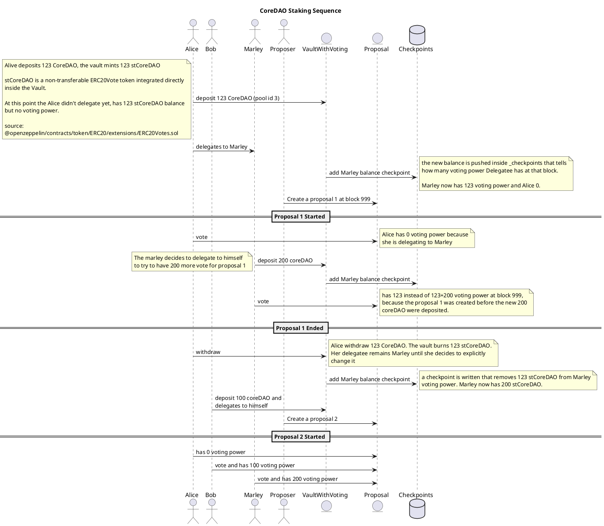

# CoreDAO Staking Sequence Diagram

```plantuml
@startuml

title
CoreDAO Staking Sequence
end title

actor       Alice       as alice
actor       Bob       as bob
actor       Marley       as marley
actor       Proposer       as proposer
entity      VaultWithVoting      as vault
entity      Proposal      as proposal
database    Checkpoints      as checkpoints

alice -> vault: deposit 123 CoreDAO (pool id 3)
note left
Alive deposits 123 CoreDAO, the vault mints 123 stCoreDAO

stCoreDAO is a non-transferable ERC20Vote token integrated directly
inside the Vault.

At this point the Alice didn't delegate yet, has 123 stCoreDAO balance
but no voting power.

source:
@openzeppelin/contracts/token/ERC20/extensions/ERC20Votes.sol
end note

alice -> marley: delegates to Marley

vault -> checkpoints: add Marley balance checkpoint
note right
the new balance is pushed inside _checkpoints that tells
how many voting power Delegatee has at that block.

Marley now has 123 voting power and Alice 0.
end note

proposer -> proposal : Create a proposal 1 at block 999
== Proposal 1 Started ==

alice -> proposal : vote
note right
Alice has 0 voting power because
she is delegating to Marley
end note

marley -> vault: deposit 200 coreDAO
note left
The marley decides to delegate to himself
to try to have 200 more vote for proposal 1
end note

vault -> checkpoints: add Marley balance checkpoint

marley -> proposal : vote
note right
has 123 instead of 123+200 voting power at block 999,
because the proposal 1 was created before the new 200
coreDAO were deposited.
end note

== Proposal 1 Ended ==
alice -> vault: withdraw
note right
Alice withdraw 123 CoreDAO. The vault burns 123 stCoreDAO.
Her delegatee remains Marley until she decides to explicitly
change it
end note

vault -> checkpoints: add Marley balance checkpoint
note right
a checkpoint is written that removes 123 stCoreDAO from Marley
voting power. Marley now has 200 stCoreDAO.
end note

bob -> vault: deposit 100 coreDAO and\ndelegates to himself
proposer -> proposal: Create a proposal 2

== Proposal 2 Started ==

alice -> proposal: has 0 voting power
bob -> proposal: vote and has 100 voting power
marley -> proposal: vote and has 200 voting power

@enduml
```